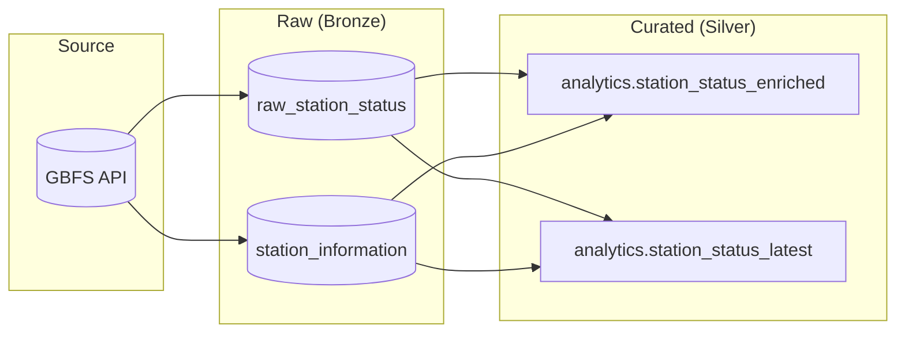

# Analytics layer — Phase 3

This directory documents the **curated analytics interface** on top of raw GBFS
tables. Raw relations remain the ingestion system of record; **`analytics`**
is the stable contract for ML extracts, BI, and monitoring.

## Layering (raw → curated)



## Logical model (star-ish)

```mermaid
erDiagram
  RAW_STATION_STATUS {
    varchar station_id PK_FK
    timestamptz last_reported PK
    int num_bikes_available
    int num_docks_available
    timestamptz ingestion_timestamp
  }

  STATION_INFORMATION {
    varchar station_id PK
    text name
    float lat
    float lon
    int capacity
  }

  STATION_INFORMATION ||--o{ RAW_STATION_STATUS : "station_id"

  ANALYTICS_ENRICHED {
    varchar station_id
    timestamptz last_reported
    int num_bikes_available
    text name
    int capacity
  }

  RAW_STATION_STATUS ||--|| ANALYTICS_ENRICHED : "view"
  STATION_INFORMATION ||--|| ANALYTICS_ENRICHED : "view"
```

## Grain and semantics

| Object | Grain | Notes |
|--------|--------|--------|
| `raw_station_status` | One row per `(station_id, last_reported)` | Append-only fact table from GBFS `station_status`. |
| `station_information` | One row per `station_id` | Dimension; **SCD Type 1** (current row upserted each run). |
| `analytics.station_status_enriched` | Same as raw status + dimension columns | Primary consumer interface for time-series pulls. |
| `analytics.station_status_latest` | One row per `station_id` | Latest snapshot by `last_reported`, tie-break `ingestion_timestamp`. |

## Data dictionary (curated views)

### `analytics.station_status_enriched`

| Column | Type | Description |
|--------|------|-------------|
| `station_id` | `varchar` | GBFS station identifier. |
| `last_reported` | `timestamptz` | Operator-reported observation time (UTC). |
| `ingestion_timestamp` | `timestamptz` | When the pipeline wrote this row (UTC). |
| `num_bikes_available` | `int` | Bikes available. |
| `num_docks_available` | `int` | Docks available. |
| `num_bikes_disabled` | `int` | Disabled bikes. |
| `num_docks_disabled` | `int` | Disabled docks. |
| `is_renting` | `boolean` | GBFS renting flag. |
| `is_returning` | `boolean` | GBFS returning flag. |
| `status` | `varchar` | GBFS station status. |
| `name` | `text` | Station name (from dimension). |
| `lat`, `lon` | `double` | Coordinates. |
| `capacity` | `int` | Station capacity. |
| `address` | `text` | Address (nullable). |
| `groups` | `text[]` | Station groups (nullable / empty). |
| `station_info_updated_at` | `timestamptz` | When dimension row was last upserted. |

### `analytics.station_status_latest`

Same columns as `station_status_enriched`, one row per station (see grain above).

## Data quality metric views

| View | Meaning |
|------|---------|
| `analytics.v_dq_orphan_status_count` | Status rows with no matching `station_information`. |
| `analytics.v_dq_negative_availability_count` | Negative bike/dock counts. |
| `analytics.v_dq_ingestion_before_report_count` | `ingestion_timestamp < last_reported`. |
| `analytics.v_dq_duplicate_grain_count` | Duplicate `(station_id, last_reported)` groups. |

Run automated checks:

```bash
python -m src.storage.data_quality
python -m src.storage.data_quality --json
```

Exit code **0** if all checks pass, **1** otherwise.

## Glossary

- **Grain** — What one row represents.
- **Fact** — Measurements over time (here: availability snapshots).
- **Dimension** — Descriptive attributes (here: station profile).
- **SCD Type 1** — Overwrite dimension attributes in place (no history).
- **Lineage** — GBFS → raw tables → `analytics` views → consumers.

## Integrity report template

See [integrity_report_template.md](./integrity_report_template.md).
